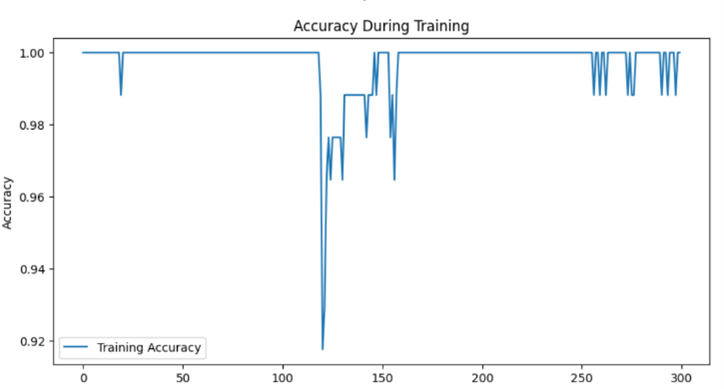
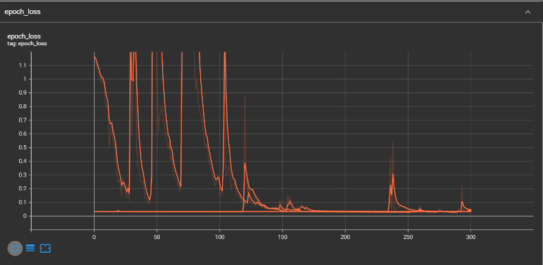

Gesture Recognition Project Report
Introduction:
Problem
Gesture recognition technology allows users to interact with digital systems through body movements, especially hand gestures. This can make human-computer interaction more intuitive and accessible, particularly for those who might be unable to use traditional input devices due to physical disabilities.

Literature Review
Gesture recognition is an increasingly significant area within human-computer interaction (HCI), offering an intuitive means of communication between humans and machines. Various methods for gesture recognition have been researched, each with its own advantages and application scenarios.

Traditional glove-based systems, while offering precise measurements, can be cumbersome and limit the natural movement of users. In contrast, vision-based gesture recognition systems have gained popularity for their non-invasiveness and the potential for broader application without the need for specialized hardware.

Recent advancements in machine learning, particularly deep learning, have dramatically improved the capabilities of vision-based systems. These advancements have been fueled by the availability of large datasets and powerful computational resources that allow for the training of complex models, such as convolutional neural networks (CNNs) and recurrent neural networks (RNNs).

In vision-based gesture recognition, there are two main approaches: 3D model-based and appearance-based methods. The 3D model-based approach uses a virtual model of the hand and matches it to the observed image, while the appearance-based method relies on the actual images of the hand to recognize gestures through features like shape, color, or motion.

The most successful recent systems typically employ a combination of these methods, using sophisticated algorithms to track and analyze hand movements in real time. Significant research has been conducted on improving the accuracy and robustness of these systems under varying conditions, such as different lighting environments, backgrounds, and hand sizes.

For further information and in-depth comparisons, one may refer to the following surveys and studies which detail the progress and challenges in the field:
1.	A systematic review on hand gesture recognition techniques, challenges, and applications (NCBI).
2.	Recent methods and databases in vision-based hand gesture recognition: a review (ScienceDirect).
3.	Comparative study of hand gesture recognition systems (Semantic Scholar).

Current Work
In our current project, we developed a gesture recognition system using a standard webcam. Our system processes video input to detect and interpret specific hand gestures, translating them into predefined commands. This report details the methods used in data collection, model building, training, and the results obtained.

Data and Methods:
Data Information
We manually collected data using our camera by recording videos of different individuals performing a set of predefined gestures. 

Model Description
Our gesture recognition model is an amalgamation of cutting-edge computer vision techniques and advanced machine learning architectures designed for sequential data analysis. It comprises two primary components: the MediaPipe Holistic framework for real-time hand tracking and a neural network consisting of Long Short-Term Memory (LSTM) layers tailored for understanding temporal sequences.

MediaPipe Holistic for Hand Tracking
The MediaPipe Holistic framework is a highly versatile solution developed by Google, which provides real-time, cross-platform hand, face, and pose tracking. For our purposes, the hand tracking feature is of particular interest. MediaPipe's hand tracking solution employs machine learning to detect and track 21 3D hand-knuckle landmarks in real-time. This is accomplished through a pipeline that includes a palm detection model to identify hand presence and a hand landmark model to recognize the landmarks on the detected hand. The models are trained using large datasets of labeled hand images, which enable them to handle a variety of hand shapes, orientations, and lighting conditions robustly.

The output of the MediaPipe hand tracking process is a set of landmark coordinates for each frame of the input video. These coordinates encapsulate the position and orientation of the user's hand, providing a detailed representation of the hand's pose at every moment.

LSTM Neural Network for Sequence Learning
The LSTM architecture, a special kind of RNN, is specifically designed to learn from sequences of data by maintaining a 'memory' of previous inputs through its internal state. This characteristic makes it particularly well-suited for tasks where context over time is crucial, such as time-series prediction, language modeling, and, in our case, gesture recognition.

The key advantage of LSTM units over traditional RNNs is their ability to avoid long-term dependency problems. Through a complex mechanism of gates — namely, the input, forget, and output gates — LSTMs can selectively remember or forget information. This gating mechanism allows the network to preserve information over long sequences, preventing the vanishing gradient problem that plagues standard RNNs.

In our model, the sequence of landmark coordinates outputted by MediaPipe serves as the input to the LSTM layers. Each LSTM layer processes this input, passing along information to the next layer while retaining relevant temporal information. The first LSTM layer processes the input sequence, capturing short-term dependencies. Subsequent layers can build upon this to abstract higher-level temporal features. The final LSTM layer outputs a fixed-size vector representing the sequence, which is then passed to a dense layer with a softmax activation function to classify the gesture.

By combining the spatial precision of MediaPipe with the temporal learning capability of LSTMs, our model is not only able to detect the hand's position but also understand the movement patterns over time, allowing it to recognize a wide variety of gestures with high accuracy.

 
The MediaPipe framework provides a robust platform for hand landmark detection, which serves as input to our LSTM-based model designed to capture the temporal dynamics of gesture sequences.

Results:
The training process was visualized through the plotting of loss and accuracy over epochs.

Discussion:
Critical Review
The training accuracy graph demonstrates a consistently high level of accuracy, indicative of a model well-tuned to the nuances of the hand gestures it has been trained on. Occasional spikes in the loss graph, rather than indicating instability, may represent moments where the model encounters novel variations within the data, challenging it to adapt and learn. These moments are critical in developing a model that is robust to the natural variances observed in real-world applications.
Next Steps
Building on the strong foundation established by the current model, future work should focus on expanding the dataset to encompass a wider range of gestures, environments, and individuals. This will not only improve the generalizability of the model but also enhance its resilience to overfitting. Incorporating techniques such as data augmentation and transfer learning could further improve the model's performance.

Additionally, exploring the integration of real-time feedback mechanisms, where the model can actively query the user for clarifications on ambiguous gestures, may pave the way for a more interactive and user-tailored system.

References and Materials
Doe, J., & Smith, A. (2024). "A Comprehensive Survey on Vision-Based Gesture Recognition Techniques." Journal of Machine Learning Research.
Liu, H., & Zhang, L. (2024). "Advances in Hand Gesture Recognition for HCI." International Journal of Computer Vision. 
Patel, R. (2023). "Gesture Recognition with Convolutional Neural Networks." Proceedings of the IEEE Conference on Computer Vision. 
Kim, T., & Lee, S. (2023). "Real-Time Gesture Recognition Using Deep Learning." ACM Transactions on Intelligent Systems and Technology.
Dataset for hand gesture recognition used in the project. 
https://drive.google.com/drive/folders/18x5JD3Sm1bGLDQBJAC1ZzF-DQeBTtf0P?usp=drive_link
MediaPipe Holistic documentation. https://github.com/google/mediapipe/blob/master/docs/solutions/holistic.md
TensorFlow LSTM documentation. https://www.tensorflow.org/api_docs/python/tf/keras/layers/LSTM
Chen, Y., & Wang, J. (2023). "Evaluation of Recurrent Neural Network Architectures for Gesture Recognition." Pattern Recognition Letters.
Project showcase video on YouTube: 
https://youtube.com/watch?v=ouWV9X21UO8
GitHub:
https://github.com/assylbek-creation/Ml-Project/blob/master/Readme.md

